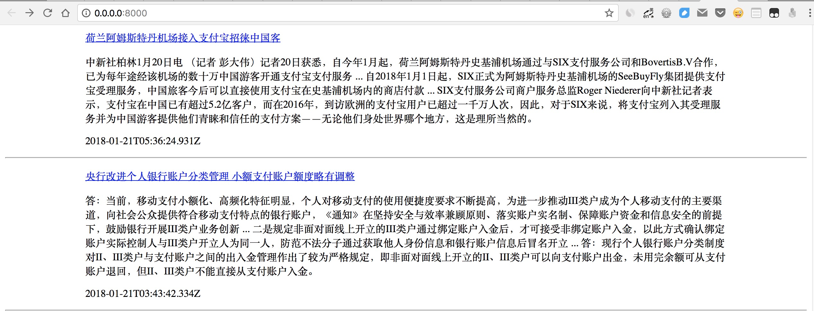

## 快速开始

在安装Sanic之前，让我们一起来看看Python在支持异步的过程中，都经历了哪些比较重大的更新。

首先是Python3.4版本引入了`asyncio`，这让Python有了支持异步IO的标准库，而后3.5版本又提供了两个新的关键字` async/await`，目的是为了更好地标识异步IO，让异步编程看起来更加友好，最后3.6版本更进一步，推出了稳定版的`asyncio`，从这一系列的更新可以看出，Python社区正迈着坚定且稳重的步伐向异步编程靠近。

### 安装

Sanic是一个支持 `async/await` 语法的异步无阻塞框架，这意味着我们可以依靠其处理异步请求的新特性来提升服务性能，如果你有`Flask`框架的使用经验，那么你可以迅速地使用`Sanic`来构建出心中想要的应用，并且性能会提升不少，我将同一服务分别用Flask和Sanic编写，再将压测的结果进行对比，发现Sanic编写的服务大概是`Falsk`的1.5倍。

仅仅是Sanic的异步特性就让它的速度得到这么大的提升么？是的，但这个答案并不标准，更为关键的是Sanic使用了`uvloop`作为`asyncio`的事件循环，`uvloop`由Cython编写，它的出现让`asyncio`更快，快到什么程度？[这篇](http://codingpy.com/article/uvloop-blazing-fast-networking-with-python/)文章中有介绍，其中提出速度至少比 nodejs、gevent 和其他Python异步框架要快两倍，并且性能接近于用Go编写的程序，顺便一提，Sanic的作者就是受这篇文章影响，这才有了Sanic。

怎么样？有没有激起你学习Sanic的兴趣，如果有，就让我们一起开始学习吧，在开始之前，你只需要有一台安装了Python的电脑即可。

> 说明：由于Windows下暂不支持安装uvloop，故在此建议使用Mac或Linux

#### 虚拟环境

程序世界一部分是对应着现实的，在生活中，我们会在不同的环境完成不同的任务，比如在厨房做饭、卧室休息，分工极其明确。

其实用Python编写应用服务也是如此，它们同样希望应用服务与开发环境是一对一的关系，这样做的好处在于，每个独立的环境都可以简洁高效地管理自身对应服务所依赖的第三方库，如若不然，各个服务都安排在同一环境，这样不仅会造成管理上的麻烦，还会使第三方库之间产生冲突。

通过上面的叙述，我们是不是可以得出这样一个核心观点：**应该在不同的环境下做不同的事** ，以此类推，写项目的时候，我们也需要为每个不同的项目构建一个无干扰的的环境，发散思维，总结一下：

> 不同的项目，需要为其构建不同的虚拟环境，以免互相干扰

构建虚拟环境的工具很多，如下：

- [virtualenv](https://virtualenv.pypa.io/en/stable/)
- [pyenv](https://github.com/pyenv/pyenv)
- [anaconda](https://www.continuum.io/downloads)

…...

以上三个工具都可以快速地帮助我们构建当前需要的Python环境，如果你之前没有使用过，可直接点开链接进行下载，如果你正在使用其它的环境管理工具，也不要紧，因为不论你使用哪一种方式，我们最终目的都是针对一个新项目构建一个新的环境。

安装配置好之后，简单看看官方提供的使用方法，就可以开始了，比如我本机使用的是`anaconda` ，安装完成后可以很方便地创建一个虚拟环境，比如这里使用Python3.6来作为本书项目的默认环境：

```shell
# 新建一个python3.6环境
conda create --name python36 python=3.6
# 安装好之后 输入下面命令进入名为python36的环境
source activate python36
```

若安装速度比较慢，可以考虑换国内源，比如 [国内镜像](https://mirrors.tuna.tsinghua.edu.cn/help/pypi/) ，至于为什么选择python3.6作为默认环境，一是因为Sanic只支持Python3.5+，二则是我们构建的项目最终是要在生产环境下运行的，所以建议最好安装Python3.6下稳定版本的`asyncio`。

#### 安装Sanic

Python安装第三方模块都是利用`pip`工具进行安装，这里也不例外，首先进入上一步我们新建的 `python3.6` 虚拟环境，然后安装：

```python
# 安装Sanic，请先使用 source activate python36 进入虚拟环境
pip install sanic
# 如果不想使用uvloop和ujson 可以这样安装
SANIC_NO_UVLOOP=true SANIC_NO_UJSON=true pip install sanic
```

通过上面的命令，你就可以在 `python3.6` 虚拟环境中安装Sanic以及其依赖的第三方库了，若想查看Sanic是否已经正确安装，可以进入终端下对应的虚拟环境，启动Python解释器，导入Sanic库：

``` shell
# 启动Python解释器
python
>>> import sanic
>>>
```

如果没有出现错误，就说明你已经正确地安装了Sanic，请继续阅读下一节，了解下如何利用Sanic来构建一个Web项目吧。

### 踏出第一步

我们将正式使用Sanic来构建一个web项目，让我们踏出第一步，利用Sanic来编写一个返回`Hello World!`字符串的服务程序。

新建一个文件，名为 `run.py` :

```python
#!/usr/bin/env python
from sanic import Sanic
from sanic.response import text

app = Sanic()


@app.route("/")
async def test(request):
    return text('Hello World!')


if __name__ == "__main__":
    app.run(host="0.0.0.0", port=8000)
```

Sanic的目标是让编写服务更加简单易用，请看上面仅用不到10行的代码，就编写好了一个简单的Web服务，运行此文件，在浏览器输入 `http://0.0.0.0:8000` ，出现的字符会让你回想起当年学c的恐惧^_^。

如果你是第一次使用Sanic，上面的代码可能会让你产生一些困扰，不用担心，接下来，我们将一起用Sanic编写一个简单的资讯阅读的web服务，在这过程中，你将逐渐地了解到Sanic的一些基本用法，如路由的构建、接受请求数据以及返回响应的内容等。

本次示例的源代码全部在github上，见[examples/demo01/news.py](https://github.com/howie6879/Sanic-For-Pythoneer/blob/master/examples/demo01/news.py)。

#### 编写一个资讯阅读项目

在开始编写之前，第一步最好写一下需求，哪怕是个简单不过的玩具项目也不能略过这个步骤，比如现在编写的资讯阅读项目，需求就一个，在页面中展示一些资讯新闻。

既然是展示资讯新闻，那么解决数据来源的问题最为重要，对于这个问题你也不用担心，因为在本次示例的源码中我编写了一个名为`get_news()`的函数专门用来返回资讯新闻数据，简化代码如下:

``` python
async def get_news(size=10):
    """
    Sanic是一个异步框架，为了更好的发挥它的性能，有些操作最好也要用异步的
    比如这里发起请求就必须要用异步请求框架aiohttp
    所以使用本服务的时候请先执行: pip install aiohttp
    数据使用的是readhub网站的api接口
    为了使这个数据获取函数正常运行，我会保持更新，所以具体代码：examples/demo01/news.py
    """
    async with aiohttp.ClientSession() as client:
        async with client.get(readhub_api, params=params, headers=headers) as response:
            assert response.status == 200
            text = await response.json()
        return text
```

这样各位就可以只专注于Sanic的代码实现，而不必考虑其他问题，我会一直维护这个数据获取函数，以保证数据正常输出，各位请放心使用。

#### 构建路由

数据的问题解决之后，我们可以开始着手于需求的实现了，根据前面的描述，此时的需求是当客户端（Web浏览器）访问`http://0.0.0.0:8000/`的时候，浏览器会立马展示服务端响应返回的10条资讯新闻（假设内容由index()函数返回），若浏览器访问的是`http://0.0.0.0:8000/2`，此时返回的就是第二页的10条资讯新闻，以此类推......

当Sanic程序实例接收到一个请求，比如前面提到的`http://0.0.0.0:8000/`，它是怎么知道这个URL可以对应到`index()`函数呢？

Sanic有一个机制来保存URL和函数（一般称之为视图函数）之间的映射关系，就像`dict`中`key`和`value`，这样当服务端接收到请求`http://0.0.0.0:8000/`，就会立马知道，接下来需要调用`index()`函数了，我们将其称之为路由。

Sanic中可以用`app.route`修饰器来定义路由，当Sanic服务启动的时候，`app.route`就会将其中传入的参数与装饰的函数自动注册好，比如下面这段代码：

``` python
@app.route("/")
async def index(request):
    """当服务端接收到客户端的/请求时，就会调用此函数"""
    return text('Hello World!')
```

此时请求`http://0.0.0.0:8000/`就会返回`Hello World!`，很显然，这不是我们想要的需求，我们的需求是展示10条资讯新闻，数据怎么来？你只需要调用`get_news()`函数，就会获取到你想要的资讯数据：

```python
@app.route("/")
async def index(request):
    # html页面模板
    html_tem = """
    <div style="width: 80%; margin-left: 10%">
        <p><a href="{href}" target="_blank">{title}</a></p>
        <p>{summary}</p>
         <p>{updated_at}</p>
    </div>
    """
    html_list = []
    # 获取数据
    all_news = await get_news()
    # 生成在浏览器展示的html页面
    for each_news in all_news:
        html_list.append(html_tem.format(
            href=each_news.get('news_info', [{}])[0].get('url', '#'),
            title=each_news.get('title'),
            summary=each_news.get('summary'),
            updated_at=each_news.get('updated_at'),
        ))

    return html('<hr>'.join(html_list))
```

运行此服务：

```shell
python run news.py
```

此时，访问`http://0.0.0.0:8000/`，你就会获得Sanic服务程序返回的资讯新闻，如下图，可以看到返回服务端提供的最新资讯：



页面成功地呈现出我们想要的结果，实在是令人兴奋，等等，不能高兴太早，我们还有一个需求，要根据浏览器输入的页数来展示内容，如：`http://0.0.0.0:8000/2`，思考一下，应该怎样优雅地完成这个需求，或许你会想，再构建一对URL与视图函数的映射关系，像下面这样：

``` python
@app.route("/2")
async def page_2(request):
```

不得不说，这是一个糟糕的解决方案，这样没法解决接下来的第3页、第4页、甚至第n页（虽然目前这个服务程序只展示到第2页），最佳实践应该是把页数当做变量来获取，Sanic的路由机制自然提供了获取动态请求参数的功能，如下：

``` python
@app.route("/<page:int>")
@app.route("/")
async def index(request, page=1):
    """
    支持/请求与/page请求方式
    具体的代码逻辑也会有一点改变，可参考：examples/demo01/news.py
    """
```

再次运行此服务：

```shell
python run news.py
```

不论是请求`http://0.0.0.0:8000/`或者`http://0.0.0.0:8000/2`，都是我们想要的结果。

#### 请求数据

细心的你可能会发现，每次编写一个视图函数的时候，总是有一个`request`参数：

``` python
async def index(request, page=1):
```

为什么必须定义这个参数，它从哪来？它有什么作用，下面我将一一为你解答。

如果你在客户端请求`http://0.0.0.0:8000/`的时候，顺手在视图函数里面打印下参数`request`，会有如下输出：

``` shell
<Request: GET />
```

看终端的输出可以了解到`request`参数实际上是一个名为`Request`的实例对象，每当服务端接收到一个请求，Sanic的`handle_request`函数必定会接收一个`Request`实例对象，这个实例对象包含了一系列请求信息。

前面说到，每个URL对应一个视图函数，而Sanic的`handle_request`接下来会将接收的`Request`实例对象作为参数传给URL对应的视图函数，也就是上面`index`的`request`参数，这样一来，就必须定义`request`来接收`Request`实例对象，其中包含的一些请求信息对视图函数来说非常重要，目前`Request`对象提供了以下属性：

- json
- token
- form
- files
- args
- raw_args
- cookies
- ip
- port
- socket
- remote_addr
- path
- url

上面只是列出了一部分属性，如果你想了解更多，可查看[request.py](https://github.com/channelcat/sanic/blob/master/sanic/request.py)源码文件了解。

为了可以实际使用下`request`，我们可以再加一个需求，比如增加一个`GET`请求的接口`http://0.0.0.0:8000/json`，如果请求不设置参数`nums`的值，则默认返回一条资讯新闻，如果设置了`nums`参数，则该接口返回的新闻数量由参数值决定，参数最大值为10：

``` json
@app.route('/json')
async def index_json(request):
    """
    默认返回一条资讯，最多十条
    """
    nums = request.args.get('nums', 1)
    # 获取数据
    all_news = await get_news()
    try:
        return json(random.sample(all_news, int(nums)))
    except ValueError:
        return json(all_news)
```

运行此服务：

```shell
python run news.py
```

此时视图函数`index_json`就可以根据接受的参数`nums`来返回对应数量的新闻，访问`http://0.0.0.0:8000/json?nums=2`，效果如下：


#### 响应

不论哪个Web框架，都是需要构建响应对象的，Sanic自然也不例外，它用的是`sanic.response`来构建响应对象，像上面的代码中可以看到：

```
from sanic.response import html, json
```

这表示我们目前构建的资讯阅读服务，分别返回了`body`格式为`html`以及`json`的响应对象，除了这两种格式，Sanic还提供了下面几种格式：

- json
- text
- raw
- html
- file
- file_stream
- stream

更多属性请看[response.py](https://github.com/channelcat/sanic/blob/master/sanic/response.py)，我们可以根据实际需求来构建响应对象，最后再返回给客户端。

#### 继续深入

不要以为现在编写的资讯服务已经很完善了，其实还有许多问题需要我们完善，比如访问`http://0.0.0.0:8000/html`这个URL会返回：

``` shell
Error: Requested URL /html not found
```
服务程序为什么会抛出这个错误？因为程序中并路由没有注册`html`，并且没有进行错误捕捉（比如此时的404），解决这个问题也很方便，比如把这个错误全部跳转到首页，代码如下：

``` python
@app.exception(NotFound)
def ignore_404s(request, exception):
    return redirect('/')
```

此时访问一些没有注册于路由的URL，比如此时的`http://0.0.0.0:8000/html`都会自动跳转到`http://0.0.0.0:8000/`。

现在，我们已经用Sanic编写了一个简单的资讯阅读服务，在编写的过程中使用了路由、数据请求、处理以及响应对象，这些基础知识足够你编写一些基本的服务，但这还远远不够，比如模板引、引入静态文件等，这些都等着我们在实践中继续深入了解。

### 总结

本章介绍了Sanic的安装以及基本的使用，目标是希望诸位可以迅速的了解并掌握Sanic的基本使用方法，并为阅读接下来的章节打一下基础。

文档以及代码：

- `Sanic` github地址：https://github.com/channelcat/sanic
- 官方教程：http://sanic.readthedocs.io/en/latest/
- demo地址：[demo01](https://github.com/howie6879/Sanic-For-Pythoner/blob/master/examples/demo01/run.py)