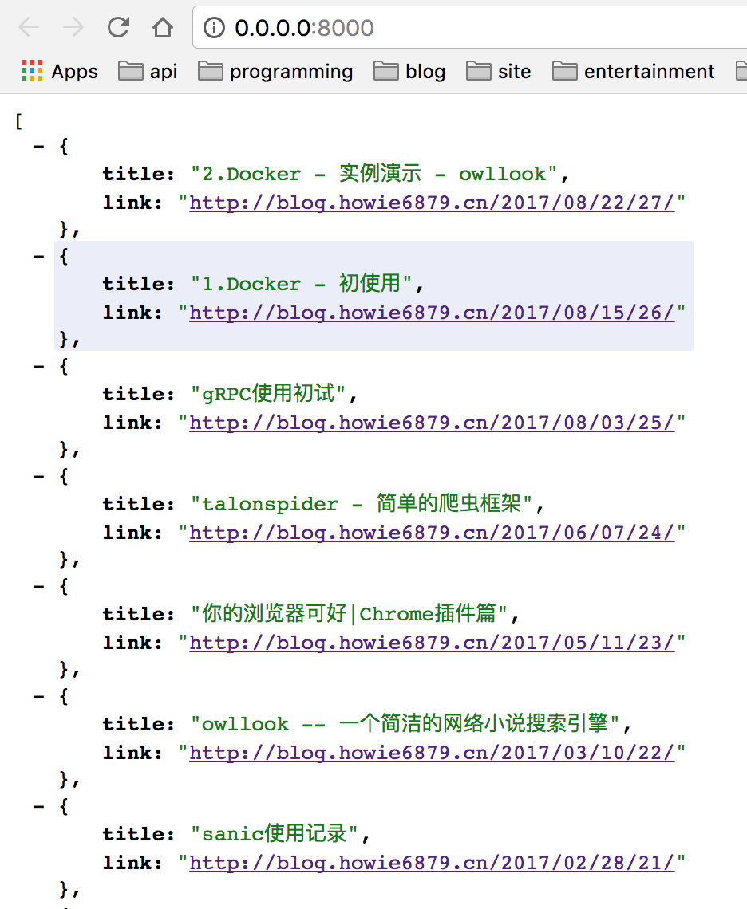
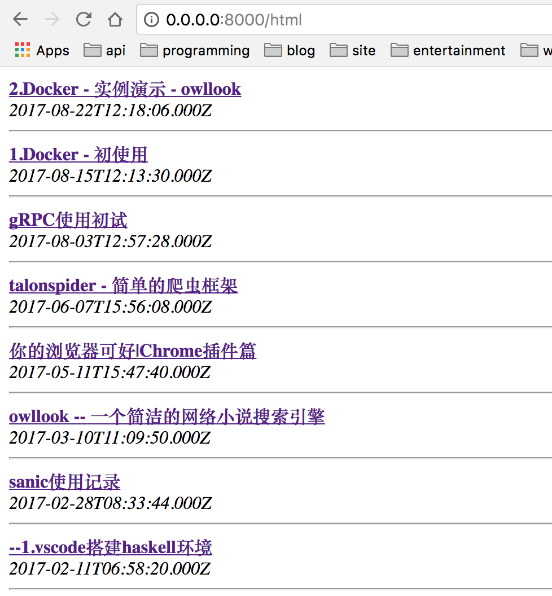
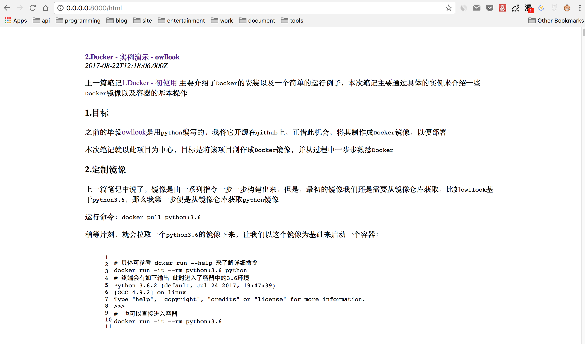

## 项目结构

通过前面的讲解，我们了解了`Sanic`的运行方式以及编写一个好的配置方案，是不是想要立马编写一个应用练练手呢？别急，请先看完这一章节，了解一下你要写的应用得用什么样的结构。

在`github`上也看了不少的`Python`项目吧，相信你也清楚，一个项目，在最外层他们应该是一样的，简单概括下，大概是下面这样的结构:

``` shell
pro_name
├── docs            # 项目文档说明
├── src or pro_name/# 项目名称
├── tests           # 测试用例
├── README.md       # 项目介绍
└──requirements.txt # 该项目依赖的第三方库
```

那接下来需要讨论的，就是 `src` 或者说`pro_name`（这个就看你心情命名了，一般与最外层一样的名字）的内部结构该是什么样的呢？

本章将写一个 `rss` 解析展示的项目用做演示。

### 普通的项目结构

一个普通的项目：

- 不需要添加后续模块功能
- 快速开发使用，不需要维护
- 无较复杂的前端需求
- 用完就走

那么就可以像 `demo01` 中一样，只需要添加一个 [run.py](https://github.com/howie6879/Sanic-For-Pythoner/blob/master/examples/demo03/sample01/src/run.py) 或者叫做 `app.py` 文件（反正这是一个启动文件，命名可随意），不论是配置、路由都写在一起就好了。

新建一个项目如下：

``` shell
sample01
├── docs
│   └── demo.md
├── src
│   └── run.py
├── tests
├── .gitignore
└──requirements.txt
```

任意一个 `rss` 源，假设项目需要将其中的文章标题以及链接提取并展示出来，比如以json格式返回，这属于很简单的功能，可以说只有一段逻辑，`run.py` 内容如下：

``` python
#!/usr/bin/env python
from sanic import Sanic
from sanic.response import json
from feedparser import parse

app = Sanic()


@app.route("/")
async def index(request):
    url = "http://blog.howie6879.cn/atom.xml"
    feed = parse(url)
    articles = feed['entries']
    data = []
    for article in articles:
        data.append({"title": article["title_detail"]["value"], "link": article["link"]})
    return json(data)


if __name__ == "__main__":
    app.run(host="0.0.0.0", port=8000)
```

访问 `http://0.0.0.0:8000/`，会返回一串json，如下：



和我们想象地一样，返回了一串`json`，接下来，问题升级，我想要将标题链接用页面展示，该怎么弄？

很容易想到，我们需要一个页面模板来承载数据，然后将json数据写入到页面模板中，最后用 `jinja2` 的 `template` 将其渲染。

道理我们都懂，`Sanic`具体需要怎么渲染呢？说白了就是对`jinja2`的使用，如下：

``` python
#!/usr/bin/env python
from sanic import Sanic
from sanic.response import json, text, html
from feedparser import parse
from jinja2 import Template

app = Sanic()

# 后面会使用更方便的模板引用方式
template = Template(
    """
    <!DOCTYPE html>
<html lang="en">
<head>
    <meta charset="UTF-8">
    <title>rss阅读</title>
    <meta name="viewport" content="width=device-width, initial-scale=1">
</head>
<body>
<article class="markdown-body">
    
    <b><a href="{{article.link}}">{{article.title}}</a></b><br/>
    <i>{{article.published}}</i><br/>
    <hr/>
    
</article>
</body>
</html>
    """
)


@app.route("/")
async def index(request):
    url = "http://blog.howie6879.cn/atom.xml"
    feed = parse(url)
    articles = feed['entries']
    data = []
    for article in articles:
        data.append({"title": article["title_detail"]["value"], "link": article["link"]})
    return json(data)


@app.route("/html")
async def rss_html(request):
    url = "http://blog.howie6879.cn/atom.xml"
    feed = parse(url)
    articles = feed['entries']
    data = []
    for article in articles:
        data.append(
            {"title": article["title_detail"]["value"], "link": article["link"], "published": article["published"]})
    html_content = template.render(articles=data)
    return html(html_content)


if __name__ == "__main__":
    app.run(host="0.0.0.0", port=8000)
```

具体结构代码见[sample01](https://github.com/howie6879/Sanic-For-Pythoner/tree/master/examples/demo03/sample01)，运行起来，然后输入 `http://0.0.0.0:8000/html` 就可以看到被展示出来的页面^_^



假设需要编写前端页面比较多，那么你就需要添加`statics` 以及 `templates` 文件夹用来管理各个界面模块，具体下面会介绍。

### 项目结构具体说明

当编写的项目过于复杂，我都会将其当做一个第三方包来管理项目中涉及的各种模块，比如 [sample02](https://github.com/howie6879/Sanic-For-Pythoneer/tree/master/examples/demo03/sample02)，目录下面你会发现有个 `__init__.py` 文件，它初始化了当前目录下的应用，然后代码中引用某个函数可以这么写：

```python
from src.views import app
```

这样，你的应用下面的模块引用起来就会特别方便，就像使用一个第三方模块一样，灵巧且方便。

每个项目的内部分布以及命名可能不一样（甚至目录比应该或多或少），但大体意思可能差不多，下面介绍本次项目 `src` 下的一些文件目录结构：

``` shell
sample02
├── docs
│   └── demo.md
├── src
│   ├── config # 配置 
│   ├── statics # css、js、img
│   ├── templates # Jinja2模板
│   └── views # 路由、逻辑处理
│   ├── __init__.py
│   ├── run.py # 启动文件
├── tests
└── requirements.txt
```

此处就可以将 `sample02` 当成一个包了，实践是检验真理的唯一标准，让我们来试试看：

首先新建文件 `/views/rss.py` ，具体代码可以看这里 [sample02](https://github.com/howie6879/Sanic-For-Pythoneer/tree/master/examples/demo03/sample02)，下面的代码片段可没办法很好的运行:

``` python
enable_async = sys.version_info >= (3, 6)

app = Sanic()

# jinjia2 config
env = Environment(
    loader=PackageLoader('views.rss', '../templates'),
    autoescape=select_autoescape(['html', 'xml', 'tpl']),
    enable_async=enable_async)


async def template(tpl, **kwargs):
    template = env.get_template(tpl)
    rendered_template = await template.render_async(**kwargs)
    return html(rendered_template)


@app.route("/html")
async def rss_html(request):
    url = "http://blog.howie6879.cn/atom.xml"
    feed = parse(url)
    articles = feed['entries']
    data = []
    for article in articles:
        data.append(
            {"title": article["title_detail"]["value"], "link": article["link"], "published": article["published"]})
    return await template('rss.html', articles=articles)
```

这里使用异步的方式引入了 `jinja2` ，需要注意的是python版本必须3.6+，否则就得使用同步的方式来引入 `jinja2` ，后面章节会继续介绍。

此时启动文件 `run.py` 只要引入 `/views/rss.py` 的 `app` 实例即可：

``` python
# !/usr/bin/env python
import sys
import os

sys.path.append(os.path.dirname(os.path.dirname(os.path.abspath(__file__))))
from src.views import app
from src.config import CONFIG

app.statics('/statics', CONFIG.BASE_DIR + '/statics')

if __name__ == "__main__":
    app.run(host="0.0.0.0", port=8000)
```

还有一些css文件这里就不介绍，具体代码请看[sample02](https://github.com/howie6879/Sanic-For-Pythoner/tree/master/examples/demo03/sample02)，运行起来，然后输入 `http://0.0.0.0:8000/html` 就好，效果如下图：



### 说明

关于 `views templates statics` 内部的构造也是值得一写，这就涉及到蓝图 `Blueprint` ，后面介绍蓝图的时候会进行介绍。

代码地址：[demo03](https://github.com/howie6879/Sanic-For-Pythoneer/tree/master/examples/demo03/)


