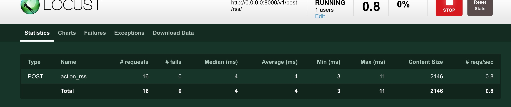

## 测试与部署

在项目结构那一节说过，一个服务的基本结构大概是怎么样的，这里再列出来回顾下：

``` shell
pro_name
├── docs            # 项目文档说明
├── src or pro_name/# 项目名称
├── tests           # 测试用例
├── README.md       # 项目介绍
└──requirements.txt # 该项目依赖的第三方库
```

一个服务编写完成后，在部署之前，你需要做的一步就是进行单元测试，首先你要确定目前的代码是可以完美运行的，然后测试用例还可以让你在下次修改代码逻辑进行版本迭代的时候，只要再跑一次对应的测试用例就可以快速地确定此次的版本依旧是完美的，大大节省时间，一般集成测试的时候都需要跑测试用例的脚本。

本次使用的例子还是继续在[demo06](https://github.com/howie6879/Sanic-For-Pythoneer/tree/master/examples/demo06/sample)的基础上进行演示，提醒一下诸位，在继续阅读前可以先大致看下目录中`test`的代码哈。

### 测试

#### 单元测试
Sanic进行单元测试的时候，官方推荐使用的是[pytest](https://github.com/pytest-dev/pytest)，具体怎么对Sanic构建的服务进行测试呢，别急，Sanic开发团队提供了关于`pytest`的插件，见[pytest-sanic](https://github.com/yunstanford/pytest-sanic)，使用起来也是非常简单。

让我们结合前面的例子，利用[pytest-sanic](https://github.com/yunstanford/pytest-sanic)测试一下[demo06](https://github.com/howie6879/Sanic-For-Pythoneer/tree/master/examples/demo06/sample)中的`rss api`服务，先看下目录结构：

``` shell
tests
├── setting.py
└── test_rss.py
```

首先在`setting.py`中定好请求的数据：

``` python
# setting.py
def rss_data():
    return {
        "name": "howie6879"
    }
```

然后编写对应的测试用例，这里是关于`/v1/post/rss/`的一个`POST`请求测试，代码如下：

``` python
# test_rss.py
async def test_http_rss(test_cli):
    data = setting.rss_data()
    response = await test_cli.post('/v1/post/rss/', data=ujson.dumps(data))
    resp_json = await response.json()
    assert resp_json['status'] == 1

# 运行测试 pytest tests/test_rss.py
"""
================================================= test session starts ==================================================
platform darwin -- Python 3.6.0, pytest-3.2.3, py-1.4.34, pluggy-0.4.0
rootdir: /Users/howie/Documents/programming/python/git/Sanic-For-Pythoneer/examples/demo06/sample, inifile:
plugins: celery-4.0.2, sanic-0.1.5
collected 2 items

tests/test_rss.py .s

========================================= 1 passed, 1 skipped in 2.13 seconds ==========================================
"""
```
可以看到测试通过，全部测试代码在[这里](https://github.com/howie6879/Sanic-For-Pythoneer/tree/master/examples/demo06/sample/tests)，最好可以直接clone下来跑一遍，细心的朋友可能注意到了测试用例结果中的这句话`1 passed, 1 skipped in 2.13 seconds `，为什么会有一个测试跳过呢？

因为在实际编写项目的过程中，你的测试用例很可能会分好多种，比如在编写微服务的过程中，同样一套处理逻辑，你需要分别实现`HTTP`和`gRPC`两种调用方式，测试代码里面我就多写了一个测试`gRPC`的配置，不过我设置了参数：`DIS_GRPC_TEST = True`，没有启用`gRPC`的测试，这里只是举个例子，具体还是要看诸位的需求，用本次的例子作为参考，就算改动起来也并没什么难度。

#### 压力测试
说完了如何对Sanic编写的服务进行单元测试，接下来稍微讲下如何进行压力测试，压力测试最好在内外网都进行测试下，当然服务器配置是你定，然后在多个服务器上部署好服务，启动起来，利用负载均衡给压测代码一个固定的ip，这样对于服务的水平扩展测试就会很方便。

压测可以考虑使用[locust](https://github.com/locustio/locust)，看看现在`tests`下的目录结构：

``` shell
├── locust_rss
│   ├── __init__.py
│   ├── action.py
│   ├── locust_rss_http.py
│   ├── locustfile.py
│   └── utils.py
├── setting.py
└── test_rss.py
```

新增了`locust_rss`文件夹，首先在`action.py`定义好请求地址与请求方式：

``` python
HTTP_URL = "http://0.0.0.0:8000/v1/post/rss/"
GRPC_URL = "0.0.0.0:8990"


def json_requests(client, data, url):
    func_name = inspect.stack()[1][3]
    headers = {'content-type': 'application/json'}
    return post_request(client, data=json.dumps(data), url=url, func_name=func_name, headers=headers)


def action_rss(client):
    data = {
        "name": "howie6879"
    }
    json_requests(client, data, HTTP_URL)
```
压测怎么个压测法，请求哪些接口，接口请求怎么分配，都在`locust_rss_http.py`里定好了：

``` python
class RssBehavior(TaskSet):
    @task(1)
    def interface_rss(self):
        action.action_rss(self.client)
```

然后需要发送请求给目标，还需要判断是否请求成功，这里将其封装成函数，放在`utils.py`里，比如`post_request`函数：

``` python
def post_request(client, data, url, func_name=None, **kw):
    """
    发起post请求
    """
    func_name = func_name if func_name else inspect.stack()[1][3]
    with client.post(url, data=data, name=func_name, catch_response=True, timeout=2, **kw) as response:
        result = response.content
        res = to_json(result)
        if res['status'] == 1:
            response.success()
        else:
            response.failure("%s-> %s" % ('error', result))
        return result
```

`locustfile.py`是压测的启动文件，必不可少，我们先请求一次，看看能不能请求成功，如果成功了再将其正式运行起来：

``` shell
cd Sanic-For-Pythoneer/examples/demo06/sample/tests/locust_rss

# 只想跑一次看看有没有问题 记得先将你编写的服务启动起来哦
locust -f locustfile.py --no-web -c 1 -n 1

# Output: 表示没毛病
[2018-01-14 14:54:30,119] 192.168.2.100/INFO/locust.main: Shutting down (exit code 0), bye.
 Name                                                          # reqs      # fails     Avg     Min     Max  |  Median   req/s
--------------------------------------------------------------------------------------------------------------------------------------------
 POST action_rss                                                    1     0(0.00%)    1756    1756    1756  |    1800    0.00
--------------------------------------------------------------------------------------------------------------------------------------------
 Total                                                              1     0(0.00%)                                       0.00

Percentage of the requests completed within given times
 Name                                                           # reqs    50%    66%    75%    80%    90%    95%    98%    99%   100%
--------------------------------------------------------------------------------------------------------------------------------------------
 POST action_rss                                                     1   1800   1800   1800   1800   1800   1800   1800   1800   1756
--------------------------------------------------------------------------------------------------------------------------------------------

```
好了，没问题了，可以执行`locust -f locustfile.py`，然后访问`http://0.0.0.0:8089/`，如下图：



当然，这里只是大概讲解下如何进行压测，至于真实环境下，还是需要诸位继续摸索。

### 部署

千辛万苦，终于到了这一步，我们历经代码编写、单元测试、压力测试终于到了这一步，将我们的服务正式部署！

在继续阅读之前，请你万万先读一遍[官方的Deploying](http://sanic.readthedocs.io/en/latest/sanic/deploying.html)。

好了，你现在肯定知道了Sanic服务的两种启动方式，分别如下：

- python -m sanic server.app --host=0.0.0.0 --port=8000 --workers=4 
- gunicorn myapp:app --bind 0.0.0.0:8000 --worker-class sanic.worker.GunicornWorker

至于选哪种启动方式，我觉得都可以，看你心情了，下面直接说下如何部署：

- Gunicorn + Supervisor + Caddy
- Docker

对于用Gunicorn启动，可以将配置写在自己定义的配置文件中，比如`config/gunicorn.py`：

``` python
# gunicorn.py
bind = '127.0.0.1:8001'
backlog = 2048

workers = 2
worker_connections = 1000
timeout = 30
keepalive = 2

spew = False
daemon = False
umask = 0
```

然后直接运行`gunicorn -c config/gunicorn.py --worker-class sanic.worker.GunicornWorker server:app`就启动了。

为了方便对此服务的管理，可以使用`Supervisor`来对服务进行启动、停止，比如使用如下配置：

``` shell
[program:demo]
command      = gunicorn -c config/gunicorn.py --worker-class sanic.worker.GunicornWorker server:app
directory    = /your/path/
user         = root
process_name = %(program_name)s
autostart    = true
autorestart  = true
startsecs    = 3
redirect_stderr         = true
stdout_logfile_maxbytes = 500MB
stdout_logfile_backups  = 10
stdout_logfile          = ~/supervisor/demo.log
environment             = MODE="PRO"
```

最后，你需要对该服务(假设是一个网站)的"站点"进行配置，推荐使用Caddy服务器，[Caddy](https://github.com/mholt/caddy)是使用Go编写的Web服务器，它简单易用且支持自动化HTTPS，你只需按照官方文档编写好你自己的Caddyfile，比如目前的例子：

``` shell
your.domain.com {
    proxy / 127.0.0.1:8001
    timeouts none
    gzip
}

your.domain.com {
    redir http://your.domain.com
}
```

在利用`Supervisor`守护一个Caddy的服务进程，至此，你的服务站点就搭建好了。

现在`Docker`的崛起，使得我们的部署方式也发生了改变，我们完全可以将上面编写的服务`Docker`化，然后构建自己的集群，一个服务器启动一个服务节点，再启动一个镜像做负载均衡，岂不是美滋滋。

这个例子中我已经写了一个[Dockerfile](https://github.com/howie6879/Sanic-For-Pythoneer/tree/master/examples/demo06/sample/Dockerfile)，你可以按照如下方式进行启动：

``` shell
docker build -t demo:0.1 .
docker run -d -p 8001:8001 demo:0.1
```

我建议使用`daocloud`来体验一下，你可以关联自己主机，不一定非要用我这个例子中的服务镜像，你大可随意下载一个镜像

## 说明

代码见[demo06](https://github.com/howie6879/Sanic-For-Pythoneer/tree/master/examples/demo06/sample)